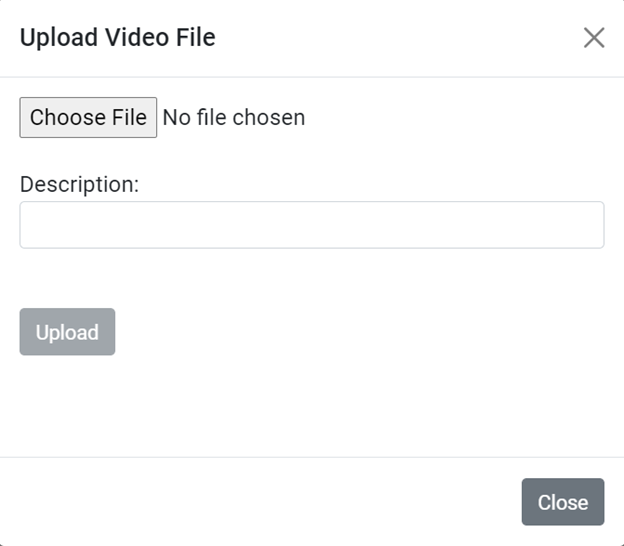
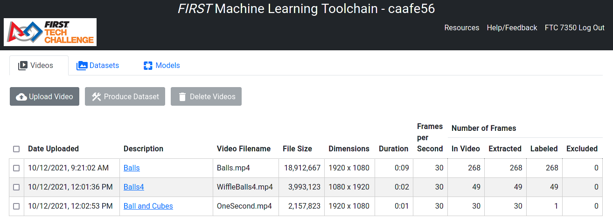

# **Design Overview**

FMLTC stands for FIRST Machine Learning Toolchain.

The goal of the project is to deliver the source code for a web-based set of
tools that allow a FIRST Tech Challenge (FTC) or FIRST Robotics Competition
(FRC) team to  generate a custom TensorFlow inference model for object
detection and tracking. 

The target platform for the project is Google Cloud:
 * App Engine for hosting the web application
 * Cloud Functions for operations that take longer than 30 seconds
 * Cloud Datastore/Firestore for storing records
   + Application records
     + Teams
     + Trackers
     + DatasetRecordWriters
     + DatasetZippers
   + User records
     + Videos
     + VideoFrames
     + Datasets
     + DatasetRecords
 * Cloud Storage for storing files
   + Application files
     + javascript files
     + css files
     + files to trigger Cloud Functions
     + Object Detection package files
     + SSD MobileNet checkpoint files
   + User files
     + Videos
     + Images
     + TensorFlow Record
     + Models

The steps involved in generating the model are:
1. Upload videos
2. Label objects in video frame images with assistance from object tracking
3. Produce TensorFlow records from the labeled images
4. Train a TensorFlow model
5. Convert the model to TFLite format

# Login screen

When a user visits the website for the first time, they are presented with a
login screen.

The user selects their FIRST program, enters their team number and team code,
and clicks Submit.

#### Design Details

In the server, the program, team number, and team code is looked up in the
teams file. If found, the values are stored in the session so the user doesn't
have to login again on the same machine.

# Main screen

After the user logs in, the main screen appears. There are three tabs
 * Videos - show the videos that this team has uploaded
 * Datasets - show the datasets that this team has produced
 * Models - show the TensorFlow models that this team has generated

## Videos tab

At first, since the team has not yet uploaded any videos, the Videos tab looks like this:

### Uploading a Video

When the user clicks Upload Video, they are presented with the Upload Video File dialog:

The user chooses a file, enters a description, and clicks Upload.

#### Design Details

The client sends a /prepareToUploadVideo request to the server.

The server does the following:
 * creates a unique id for the video
 * generates a signed url for uploading the video file to Cloud Storage
 * inserts a video entity into the database
 * triggers the start of a Cloud Function which will extract the frames of the video
The server's response includes the video id and the upload url.

The client sends the video file to the upload url. As the file is uploaded, a
progress bar is updated.

When the upload has finished, the dialog is dismissed.

In the server, the Cloud Function starts up and:
 * if necessary, waits until the video file has finished uploading to Cloud Storage
 * writes the video file from  Cloud Storage to a temporary file
 * opens the temporary video file with OpenCV.
 * updates the video entity with the width, height, frames per second, and frame count.
 * extracts frames of the video and writes them as jpeg image files to Cloud Storage
 * periodically checks how long it has been running:
   + if it has be running for over 430 seconds, it triggers the start of  
     another Cloud Function to continue extracting frames.
   + if it has be running for over 470 seconds, it terminates.
 * deletes the temporary file

Until frame extraction is complete, the client requests the video entity from 
the server once per second and updates the display.

When frame extraction is complete, the description becomes a clickable link.

### Labeling a Video

### Creating a Dataset

## Datasets tab

### Training a Model

## Models tab

### Monitoring Model Training

### More Training
