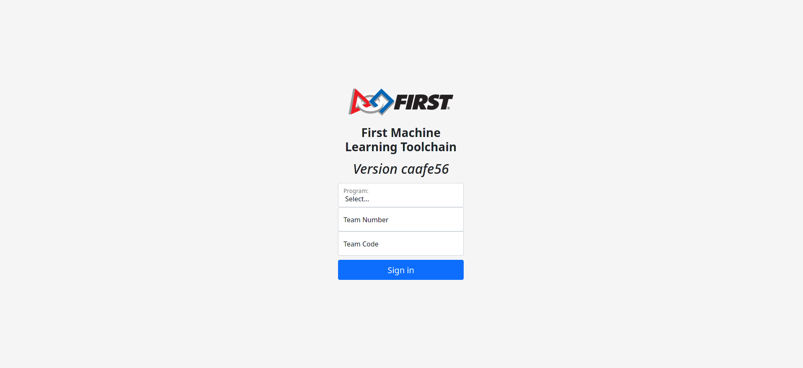
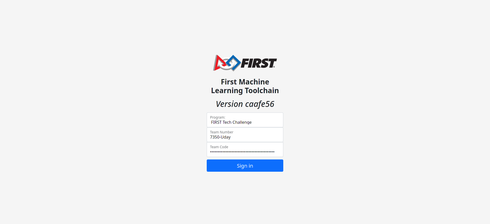
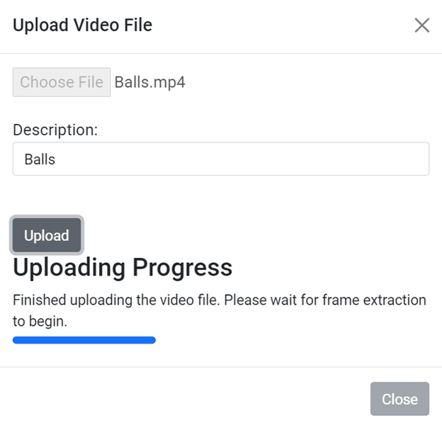
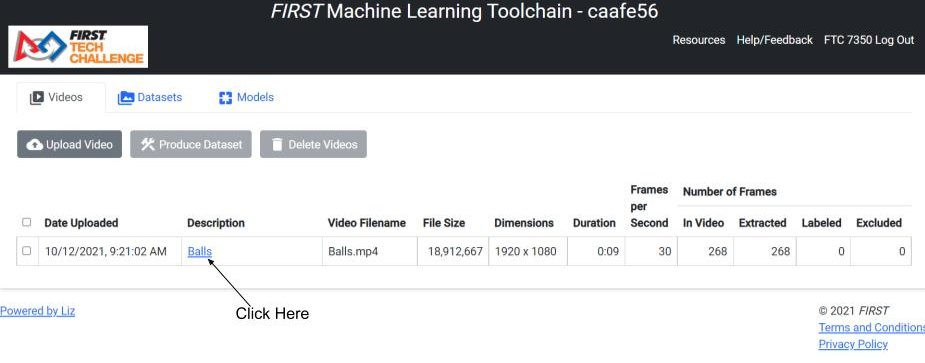

# **FIRST Machine Learning Toolchain**

The goal of the project is to deliver the source code for a web-based set of
tools that allow a FIRST Tech Challenge (FTC) or FIRST Robotics Competition
(FRC) team to  generate a custom TensorFlow inference model for object
detection and tracking.

The target platform for the project is Google Cloud:
 * App Engine for hosting the web application
 * Cloud Functions for operations that take longer than 30 seconds
 * Cloud Datastore/Firestore for storing entities
   + Application entities
     + Team entities
     + Tracker entities
     + DatasetRecordWriter entities
     + DatasetZipper entities
   + User entities
     + Video entities
     + VideoFrame entities
     + Dataset entities
     + DatasetRecord entities
 * Cloud Storage for storing files
   + Application files
     + javascript files
     + css files
     + files to trigger Cloud Functions
     + Object Detection package files
     + SSD MobileNet checkpoint files
   + User files
     + Video files
     + Image files
     + TensorFlow Record files
     + files for the TensorFlow Model

The steps involved in generating the model are:
1. Upload videos
2. Label objects in video frame images with assistance from object tracking
3. Produce TensorFlow records from the labeled images
4. Train a TensorFlow model
5. Convert the model to TFLite format

# Login page

When a user visits the website for the first time, they are presented with a
login page.

The user selects their FIRST program, enters their team number and team code,
and clicks Submit.

Internal Details

> When the users clicks Submit:
> * the client:
>   * sends a /login request to the server
>   * the server:
>     * reads the teams file from Cloud Storage
>     * looks for a line with matching FIRST program, team number, and team code
>     * if the team is found:
>       * stores the values in the session so the user doesn't have to login next time on the same machine
>       * responds with a redirect to the main page
>     * if the team is not found:
>       * responds with the login page with an error message

# Main page

After the user logs in, the main page appears. There are three tabs
 * Videos - show the videos that this team has uploaded
 * Datasets - show the datasets that this team has produced
 * Models - show the TensorFlow models that this team has generated

## Videos tab

At first, since the team has not yet uploaded any videos, the Videos tab looks like this:

### Uploading a Video

When the user clicks Upload Video, they are presented with the Upload Video File dialog:

The user chooses a file, enters a description, and clicks Upload.

As the file is uploaded, a progress bar is updated.

When the upload has finished, the dialog is dismissed.

Internal Details

> When the users clicks Upload:
> * the client:
>   * sends a /prepareToUploadVideo request to the server
>   * the server:
>     * creates a unique id for the video
>     * generates a signed url for uploading the video file to Cloud Storage
>     * inserts a video entity into Cloud Datastore/Firestore
>     * triggers the start of a Cloud Function that will extract the frames of
>       the video
>     * updates the video entity, setting the frame extraction triggered time to the
>       current time
>     * responds with the video id and the upload url
> * the client:
>   * sends the video file to the upload url
> * the Cloud Function:
>   * reads the video file from Cloud Storage and writes it to a temporary file,
>     waiting until the video file has finished uploading if necessary
>   * opens the temporary file with OpenCV
>   * determines the number of frames in the video
>   * inserts video frame entities into in Cloud Datastore/Firestore
>   * updates the video entity, storing the width, height, frames per second, frame
>     count, and frame extraction start time
>   * in a loop:
>     * reads a frame of the video
>     * writes the video frames as jpeg image files in Cloud Storage
>     * updates the video frame entity, storing the image blob name
>     * updates the video entity, incrementing the extracted frame count and included frame count
>   * periodically updates the video entity, setting the frame extraction active
>     time to the current time
>   * periodically checks how long it has been running:
>     * if it is within 70 seconds of the estimated time limit, it triggers the start of
>       another Cloud Function to continue extracting frames.
>     * if it is within 30 seconds of the estimated time limit, it terminates.
>   * deletes the temporary file
> * the client:
>   * periodically sends a /retrieveVideoEntity request to the the server to
>     determine the progress of frame extraction
>   * the server:
>     * responds with the video entity

When frame extraction is complete, the description becomes a clickable link. To
label the objects in a video, the user clicks on the description for that video.

### Labeling a Video

The Video Frame Labeling page allows the user to view the frames of the video
and the labeled objects.

As shown in the image above, the user can:
 * adjust the size of the frame viewer
 * navigate through the frames of the video
 * find frames that have not been labeled
 * play the video forward or reverse
 * exclude a frame from datasets made from the video in the future

Internal Details

> When the Video Frame Labeling page is loaded:
> * the client:
>   * sends one or more /retrieveVideoFrameEntitiesWithImageUrls requests to the server.
>     Each request asks for up to 100 video frame entities.
>   * the server:
>     * generates a signed url for each frame image requested
>     * responds with the video frame entities, with each entity containing a
>       signed url for requesting the image from Cloud Storage.
> * the client:
>   * requests the images from Cloud Storage using the signed urls

The progress bar on the upper right area of the page indicates how many entities
and images have been received. If the user navigates to a frame whose image has
not been received yet, the frame viewer will be blank.

The following buttons remain disabled until all frame entities have been
received:
  * the buttons that find frames that have not been labeled
  * the button that starts tracking

#### Drawing a Box and Entering a Label

To label an object on the frame, the user clicks the mouse in the frame viewer,
at the upper-left corner of the object, holds the mouse button down and drags to
the lower-right corner, and then releases the mouse button. A new row is added
to the table on the right side and the user enters a label for the object.

The user should use consistent labels for the objects. For example, in the video
shown here, all wiffle balls will be labeled "w".

Internal Details

> Each time a box or label is created or modified:
> * the client:
>   * sends a /storeVideoFrameBboxesText request to the server
>   * the server:
>     * updates the video frame entity, storing the boxes and labels
>     * updates the video entity, updating the labeled frame count

#### Tracking

Once all objects on the first frame are labeled, the user can use the tracking
feature to label the rest of the frames. There are several algorithms available
for tracking. The default algorithm is CSRT (discriminative correlation filter
tracker with channel and spatial reliability) and it provides high accuracy and
is relatively quick.

To start tracking, the user clicks the start tracking button.

The tracker can take up to 30 seconds to begin processing the video frames.
Once it starts, the frame viewer will navigate through the frames and show
the tracked boxes. If the boxes aren't accurately placed, the user can click
the Pause Tracking button to pause the tracker and then they can adjust the
boxes.

The user can click the Continue Tracking button to continue tracking
or click the Stop Tracking button to stop tracking.

Internal Details

> When the user clicks the start tracking button:
> * the client sends a /prepareToStartTracking request to the server
>   * the server:
>     * creates a unique id for the tracker
>     * inserts a tracker entity and a tracker client entity into Cloud Datastore/Firestore
>       These entities will be used to manage communication between the tracker and the client.
>     * updates the video entity, storing the tracker id
>     * triggers the start of a Cloud Function that will track objects in the video
>     * responds with the tracker id.
>
> * the Cloud Function:
>   * reads the video file from Cloud Storage and writes it to a temporary file
>   * opens the temporary file with OpenCV
>   * reads a frame of the video
>   * create one OpenCV tracker for each box drawn on the video frame
>   * repeats the following until it reaches the end of the video
>     * reads another frame of the video
>     * updates each tracker with the new frame and gets the new bounding box
>     * stores the new bounding boxes in the tracker entity
>     * waits for the bounding boxes to be approved or adjusted by the client
>   * periodically:
>     * checks whether the user has pressed the stop tracking button
>     * checks whether the tracker client entity has not been updated in over 2 minutes
>     * checks how long it has been running:
>       * if it is within 70 seconds of the estimated time limit, it triggers the start of
>         another Cloud Function to continue tracking objects.
>       * if it is within 30 seconds of the estimated time limit, it terminates.
>   * deletes the temporary file
>
> * the client:
>  * sends a /retrieveTrackedBboxes request to the server
>  * the server:
>    * writes the current time in the tracker client entity in Cloud Datastore/Firestore
>    * responds with the new boxes from the tracker, if available
>  * periodically sends a /trackingClientStillAlive request to the server
>  * the server:
>    * writes the current time in the tracker client entity in Cloud Datastore/Firestore

 This allows the tracker in the server
> to know if the user has closed the browser window/tab.
>
>
>
> The server

### Creating a Dataset

### Deleting a Video

## Datasets tab

### Training a Model

### Deleting a Dataset

## Models tab

### Monitoring Model Training

### More Training

### Deleting a Model
