# **FIRST Machine Learning Toolchain**

##### Table of Contents
1. [Overview](#overview)
1. [Login Page](#login-page)
1. [Main Page](#main-page)
   1. [Videos Tab](#videos-tab)
      1. [Uploading a Video](#uploading-a-video)
      1. [Labeling a Video](#labeling-a-video)
         1. [Drawing a Box and Entering a Label](#drawing-a-box-and-entering-a-label)
         1. [Tracking](#tracking)
      1. [Producing a Dataset](#producing-a-dataset)
      1. [Deleting a Video](#deleting-a-video)
   1. [Datasets Tab](#datasets-tab)
      1. [Downloading a Dataset](#downloading-a-dataset)
      1. [Training a Model](#training-a-model)
      1. [Deleting a Dataset](#deleting-a-dataset)
   1. [Models Tab](#models-tab)
      1. [Monitoring Model Training](#monitoring-model-training)
         1. [Details Tab](#details-tab)
         1. [Graphs Tab](#graphs-tab)
         1. [Images Tab](#Images-tab)
      1. [More Training](#more-training)
      1. [Downloading a Model](#downloading-a-model)
      1. [Canceling Training](#canceling-training)
      1. [Deleting a Model](#deleting-a-model)

# Overview

The goal of the project is to deliver the source code for a web-based set of
tools that allow a FIRST Tech Challenge (FTC) or FIRST Robotics Competition
(FRC) team to  generate a custom TensorFlow inference model for object
detection and tracking.

The steps involved in generating a TensorFlow Lite inference model for object detection are:
1. Upload videos
2. Label objects in video frame images with assistance from object tracking
3. Produce TensorFlow records from the labeled images
4. Train a TensorFlow model
5. Convert the model to TFLite format

The target platform for the project is Google Cloud:
 * App Engine for hosting the web application
 * Cloud Functions for operations that take longer than 30 seconds
 * Cloud Datastore/Firestore for storing entities
   + Application entities
     + Team entities
     + Tracker entities
     + TrackerClient entities
     + DatasetRecordWriter entities
     + DatasetZipper entities
   + User entities
     + Video entities
     + VideoFrame entities
     + Dataset entities
     + DatasetRecord entities
 * Cloud Storage for storing files
   + Application files
     + javascript files
     + css files
     + files to trigger Cloud Functions
     + Object Detection package files
     + SSD MobileNet checkpoint files
   + User files
     + Video files
     + Image files
     + TensorFlow Record files
     + files for the TensorFlow Model
 * Cloud TPU (Tensor Processing Unit) for running model training jobs
 * Cloud GPU (Graphics Processing Unit) for running model evaluation jobs

# Login Page

When a user visits the website for the first time, the login page is shown.

The user selects their FIRST program, enters their team number and team code,
and clicks Submit.

Internal Details

> When the users clicks Submit:
> * the client:
>   * sends a /login request to the server
>   * the server, receiving the /login request:
>     * reads the teams file from Cloud Storage
>     * looks for a line with matching FIRST program, team number, and team code
>     * if the team is found:
>       * stores the values in the session so the user doesn't have to login
>         next time on the same machine
>       * responds with a redirect to the main page
>     * if the team is not found:
>       * responds with the login page with an error message

# Main Page

After the user logs in, the main page appears. There are three tabs
 * Videos - show the videos that this team has uploaded
 * Datasets - show the datasets that this team has produced
 * Models - show the TensorFlow models that this team has generated

## Videos Tab

At first, since the team has not yet uploaded any videos, the Videos tab looks like this:

After videos have been uploaded and labeled, the Videos tab looks like this:

Internal Details

> When the page loads:
> * the client:
>   * sends a /retrieveVideoEntities request to the server
>   * the server, receiving the /retrieveVideoEntities request:
>     * reads the Video entities from Cloud Datastore/Firestore
>     * responds with the Video entities
>   * inserts a row into the table for each video
>
> * if frame extraction has not finished on a video, the client periodically:
>   * sends a /retrieveVideoEntity request to the server
>   * the server, receiving the /retrieveVideoEntity request:
>     * reads the Video entity from Cloud Datastore/Firestore
>     * responds with the Video entity
>   * updates the row in the table for that video
>
> * if frame extraction failed to start on a video, or if frame extraction
>   has stalled, the client:
>   * sends a /startFrameExtraction request to the server
>   * the server, receiving the /startFrameExtraction request:
>     * triggers the start of a Cloud Function that will [extract the frames of
>       the video](#frame_extraction)

### Uploading a Video

When the user clicks Upload Video, the Upload Video File dialog is shown:

The user chooses a file, enters a description, and clicks Upload.

As the file is uploaded, a progress bar is updated.

When the upload has finished, the dialog goes away.

After a video is uploaded, frame extraction will start automatically. 

Internal Details

> When the users clicks Upload:
> * the client:
>   * sends a /prepareToUploadVideo request to the server
>   * the server, receiving the /prepareToUploadVideo request:
>     * creates a unique id for the video
>     * generates a signed url for uploading the video file to Cloud Storage
>     * inserts a Video entity into Cloud Datastore/Firestore, setting the
>       team_uuid, video_uuid, description, video_filename, file_size,
>       video_content_type, create_time, and video_blob_name fields
>     * triggers the start of a Cloud Function that will extract the frames of
>       the video
>     * updates the Video entity, setting the frame_extraction_triggered_time
>       field
>     * responds with the video id and the upload url
>
> * the client:
>   * sends the video file to the upload url
>
> * the Cloud Function:
>   * reads the video file from Cloud Storage and writes it to a temporary file,
>     waiting until the video file has finished uploading if necessary
>   * opens the temporary file with OpenCV
>   * determines the number of frames in the video
>   * inserts VideoFrame entities into in Cloud Datastore/Firestore, setting
>     the team_uuid, video_uuid, frame_number, and include_frame_in_dataset
>     fields
>   * updates the Video entity, setting the width, height, fps (frames per
>     second), frame_count, and frame_extraction_start_time fields
>   * repeats the following until it reaches the end of the video
>     * reads a frame of the video
>     * writes the video frames as jpeg image files in Cloud Storage
>     * updates the VideoFrame entity, setting the content_type and
>       image_blob_name fields
>     * updates the Video entity, setting the extracted_frame_count,
>       included_frame_count, and frame_extraction_active_time fields
>     * checks how long it has been running:
>       * if it is within 70 seconds of the estimated time limit, triggers the
>         start of another Cloud Function to continue extracting frames
>       * if it is within 30 seconds of the estimated time limit, terminates
>   * before termination, deletes the temporary file
>
> * the client:
>   * periodically sends a /retrieveVideoEntity request to the the server to
>     determine the progress of frame extraction
>   * the server, receiving the /retrieveVideoEntity request:
>     * reads the Video entity from Cloud Datastore/Firestore
>     * responds with the Video entity

When frame extraction finishes, the description becomes a clickable link. To
label the objects in a video, the user clicks on the description for that video.

### Labeling a Video

The Video Frame Labeling page allows the user to view the frames of the video
and the labeled objects.

As shown in the image above, the user can:
 * adjust the size of the frame viewer
 * navigate through the frames of the video
 * find frames that have not been labeled
 * play the video forward or reverse
 * exclude a frame from datasets made from the video in the future

Internal Details

> When the Video Frame Labeling page is loaded:
> * the client:
>   * sends one or more /retrieveVideoFrameEntitiesWithImageUrls requests to the server.
>     Each request asks for up to 100 VideoFrame entities.
>   * the server, receiving the /retrieveVideoFrameEntitiesWithImageUrls requests:
>     * generates a signed url for each frame image requested
>     * responds with the VideoFrame entities and, for each entity, a signed
>       url for requesting the image from Cloud Storage.
> * the client:
>   * requests the images from Cloud Storage using the signed urls

The progress bar on the upper right area of the page indicates how many entities
and images have been received. If the user navigates to a frame whose image has
not been received yet, the frame viewer will be blank.

The following buttons remain disabled until all VideoFrame entities have been
received:
  * the buttons that find frames that have not been labeled
  * the button that starts tracking

#### Drawing a Box and Entering a Label

To label an object on the frame, the user clicks the mouse in the frame viewer,
at the upper-left corner of the object, holds the mouse button down and drags to
the lower-right corner, and then releases the mouse button. A new row is added
to the table on the right side and the user enters a label for the object.

The user should use consistent labels for the objects. For example, in the video
shown here, all wiffle balls will be labeled "w".

Internal Details

> Each time a box or label is created or modified:
> * the client:
>   * sends a /storeVideoFrameBboxesText request to the server
>   * the server, receiving the /storeVideoFrameBboxesText request:
>     * updates the VideoFrame entity, setting the bboxes_text field
>     * updates the Video entity, setting the labeled_frame_count field

#### Tracking

Once all objects on the first frame are labeled, the user can use the tracking
feature to label the rest of the frames. There are several algorithms available
for tracking. The default algorithm is CSRT (discriminative correlation filter
tracker with channel and spatial reliability) and it provides high accuracy and
is relatively quick.

To start tracking, the user clicks the start tracking button.

The tracker can take up to 30 seconds to begin processing the video frames.
Once it starts, the frame viewer will navigate through the frames and show
the tracked boxes. If the boxes aren't accurately placed, the user can click
the Pause Tracking button to pause the tracker and then they can adjust the
boxes.

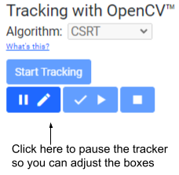

The user can click the Continue Tracking button to continue tracking
or click the Stop Tracking button to stop tracking.

Internal Details

> When the user clicks the start tracking button:
> * the client:
>   * sends a /prepareToStartTracking request to the server
>   * the server, receiving the /prepareToStartTracking request:
>     * creates a unique id for the tracker
>     * inserts a Tracker entity into Cloud Datastore/Firestore, setting the
>       team_uuid, video_uuid, tracker_uuid, update_time, video_blob_name,
>       tracker_name, scale, frame_number, and bboxes_text fields
>     * inserts a TrackerClient entity into Cloud Datastore/Firestore, setting
>       the team_uuid, video_uuid, tracker_uuid, update_time, frame_number,
>       bboxes_text, and tracking_stop_requested fields
>     * updates the Video entity, setting the tracking_in_progress and
>       tracker_uuid fields
>     * triggers the start of a Cloud Function that will track objects in the
>       video
>     * responds with the tracker id.
>
> * the Cloud Function:
>   * reads the video file from Cloud Storage and writes it to a temporary file
>   * opens the temporary file with OpenCV
>   * reads a frame of the video
>   * create one OpenCV tracker for each box drawn on the video frame
>   * repeats the following until it reaches the end of the video
>     * reads another frame of the video
>     * passes the new frame to each tracker and gets the new bounding box
>     * updates the Tracker entity, setting the frame_number, bboxes_text, and
>       update_time fields
>     * waits for the bounding boxes to be approved or adjusted by the client
>     * checks whether the TrackerClient entity indicates that the user has
>       pressed the stop tracking button and if so:
>       * removes the tracker id from the Video entity
>       * deletes the tracker and TrackerClient entities from Cloud
>         Datastore/Firestore
>       * terminates
>     * checks whether the TrackerClient entity has not been updated in over
>       two minutes and if so:
>       * assumes the user has closed the browser window
>       * removes the tracker id from the Video entity
>       * deletes the tracker and TrackerClient entities from Cloud
>         Datastore/Firestore
>       * terminates
>     * checks how long it has been running:
>       * if it is within 70 seconds of the estimated time limit, triggers the
>         start of another Cloud Function to continue tracking objects
>       * if it is within 30 seconds of the estimated time limit, terminates
>   * before termination, deletes the temporary file
>
> * the client:
>   * repeats the following until tracking is finished
>     * sends a /retrieveTrackedBboxes (initially) or a /continueTracking
>       (subsequently) request to the server
>     * the server, receiving the  /retrieveTrackedBboxes or /continueTracking
>       request:
>       * writes the current time in the TrackerClient entity in Cloud
>         Datastore/Firestore
>       * checks whether the Tracker entity has not been updated in over two
>         minutes and if so:
>         * assumes the tracker failed
>         * updates the Video entity, clearing the tracking_in_progress and
>           tracker_uuid fields
>         * deletes the tracker and TrackerClient entities from Cloud
>           Datastore/Firestore
>       * responds with the most recent boxes from the tracker or whether the
>         tracker failed
>     * if the user presses the stop button, sends a /stopTracking request to
>       the server
>     * the server, receiving the /stopTracking request:
>       * updates the TrackerClient entity, setting the tracking_stop_requested
>         field
>     * periodically sends a /trackingClientStillAlive request to the server
>     * the server, receiving the /trackingClientStillAlive request:
>       * writes the current time in the TrackerClient entity in Cloud
>         Datastore/Firestore
>

### Producing a Dataset

After the video(s) have been labeled, the user can produce a dataset.

If one or more videos is selected, the Produce Dataset button is enabled.

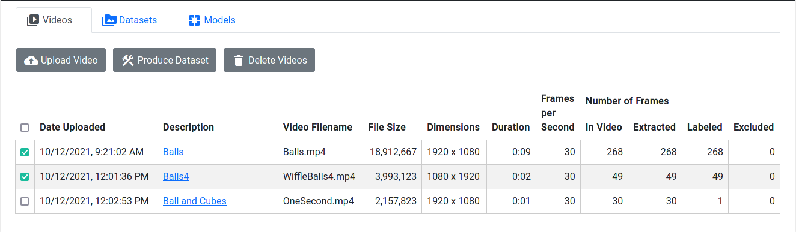

When the user clicks Produce Dataset, the Produce Dataset dialog is shown:

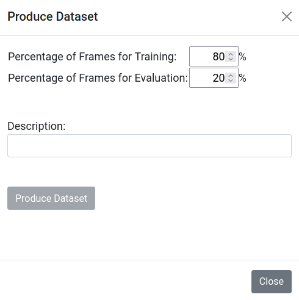

The users chooses the percentage of frames that will be used for training and
the percentage of frames that will be used for evaluation, enters a description,
and clicks Produce Dataset.

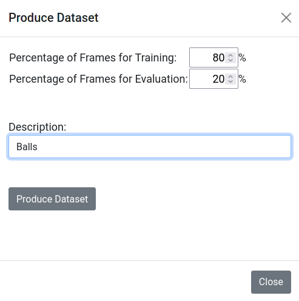

As the dataset is produced, a progress bar is updated.

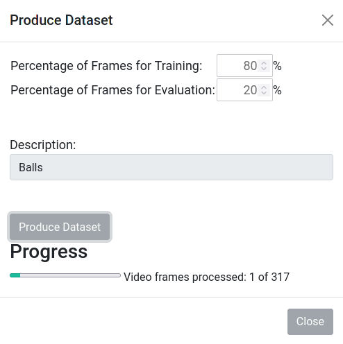

When the dataset has been produced, the dialog goes away.

Internal Details

> When the user clicks Produce Dataset:
> * the client:
>   * sends a /prepareToStartDatasetProduction request to the server
>   * the server, receiving the /prepareToStartDatasetProduction request:
>     * creates a unique id for the dataset
>     * inserts a Dataset entity into Cloud Datastore/Firestore, setting the
>       team_uuid, dataset_uuid, description, video_uuids, eval_percent,
>       and create_time fields
>     * triggers the start of a Cloud Function that will produce the dataset
>     * responds with the dataset id
>
> * the Cloud Function:
>   * reads the Video entities and VideoFrame entities from Cloud Datastore/Firestore
>   * determines which frames will be used for training and which frames will
>     be used for evaluation
>     * excludes frames for which the user has unchecked the "Include this frame
>       in the dataset" checkbox.
>     * shuffles the frames so they are randomly assigned to either training or
>       evaluation
>     * determines which TensorFlow record will contain each frame so that
>       each record contains no more than 50 frames. This small number of frames
>       ensures that each record can be produced by a single Cloud Function.
>   * updates the Dataset entity, setting the sorted_label_list,
>     train_record_count, train_frame_count, train_input_path,
>     eval_record_count, eval_frame_count, eval_input_path,
>     total_record_count, label_map_blob_name, and label_map_path fields
>   * inserts DatasetRecord entities, one for each record, into Cloud
>     Datastore/Firestore, setting the team_uuid, dataset_uuid, record_number,
>     and update_time fields
>   * inserts DatasetRecordWriter entities, one for each record, into Cloud
>     Datastore/Firestore, setting the team_uuid, dataset_uuid, record_number,
>     and update_time fields
>   * triggers the start of many Cloud Functions that will write TensorFlow
>     records
>
> * each TensorFlow record writer Cloud Function:
>   * reads the Video entity and VideoFrame entities from Cloud
>     Datastore/Firestore
>   * reads the video file from Cloud Storage and writes it to a temporary file
>   * opens the temporary file with OpenCV
>   * creates an in-memory tuple for each frame that will be included in this
>     TensorFlow record
>   * deletes the temporary video file
>   * creates a temporary directory for the TensorFlow record
>   * for each frame:
>     * creates a tensorflow.train.Example protocol message
>     * writes the protocol message into a TensorFlow record file in the
>       temporary directory
>     * updates in-memory counts for the labels in the frame and for negative
>       frames
>     * updates the DatasetRecordWriter entity, setting the frames_written
>       and update_time fields
>   * copies the TensorFlow record file from the temporary directory to Cloud
>     Storage
>   * deletes the temporary directory
>   * updates the DatasetRecord entity, setting the record_id, is_eval,
>     tf_record_blob_name, negative_frame_count, dict_label_to_count, and
>     update_time fields
>   * if all the records have been written to Cloud Storage:
>     * updates the Dataset entity, setting the dataset_completed,
>       train_negative_frame_count, train_dict_label_to_count,
>       and eval_dict_label_to_count fields
>     * deletes the DatasetRecordWriter entities asynchronously using a Cloud Function
>
> * the client:
>   * periodically sends a /retrieveDatasetEntity request to the the server to
>     determine the progress of dataset production
>   * the server, receiving the /retrieveDatasetEntity request:
>     * reads the Dataset entity from Cloud Datastore/Firestore
>     * if the dataset_completed field is not true:
>       * reads the DatasetRecordWriter entities from Cloud Datastore/Firestore
>       * sums the frames_written fields
>     * responds with the Dataset entity and, if the dataset is not complete,
>       the number of frames written to the dataset so far
>   * if the dataset_complete field is true
>     * dismisses the Produce Dataset dialog
>   * otherwise
>     * updates the progress indicator in the Produce Dataset dialog

### Deleting a Video

If one or more videos is selected, the Delete Videos button is enabled.

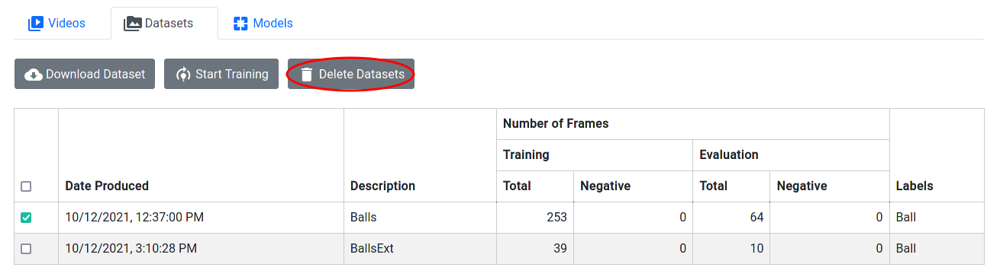

When the user clicks Delete Videos, the system determines whether the selected
videos can be deleted. Videos that have been used to produce a dataset cannot
be deleted until after the dataset is deleted.

If the selected videos cannot be deleted, a dialog explaining why is shown:

Internal Details

> When the user clicks Delete Videos
> * the client:
>   * sends a /canDeleteVideos request to the server
>   * the server, receiving the /canDeleteVideos request:
>     * reads the Video entities from Cloud Datastore/Firestore
>     * reads the Dataset entities from Cloud Datastore/Firestore
>     * checks whether any datasets are using any of the videos that might be
>       deleted.
>     * responds with a boolean value indicating whether the videos can be
>       deleted, and, if necessary, helpful messages explaining why a video
>       cannot be deleted.

If the selected videos can be deleted, a confirmation dialog is shown:

If the users clicks Yes, the selected videos and their frame images labels will be deleted.

Internal Details

> When the user clicks Yes in the confirmation dialog:
> * the client:
>   * for each video being deleted:
>     * sends a /deleteVideo request to the server
>     * the server, receiving the /deleteVideo request:
>       * updates the Video entity, setting the delete_in_progress field
>       * triggers the start of a Cloud Function that will delete the video
>       * responds with 'OK'
>
> * the Cloud Function:
>   * deletes the video file from Cloud Storage
>   * deletes the Video entity from Cloud Datastore/Firestore
>   * repeats the following until deleting is finished:
>     * deletes up to 500 video frame jpeg image files from Cloud Storage
>     * deletes up to 500 VideoFrame entities from Cloud Datastore/Firestore
>     * checks how long it has been running:
>       * if it is within 70 seconds of the estimated time limit, triggers the
>         start of another Cloud Function to continue deleting
>       * if it is within 30 seconds of the estimated time limit, terminates

## Datasets Tab

If no datasets have been produced, the Datasets tab looks like this:

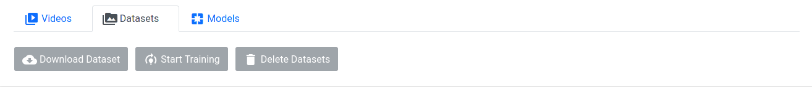

After a dataset has been produced, the Datasets tab looks like this:

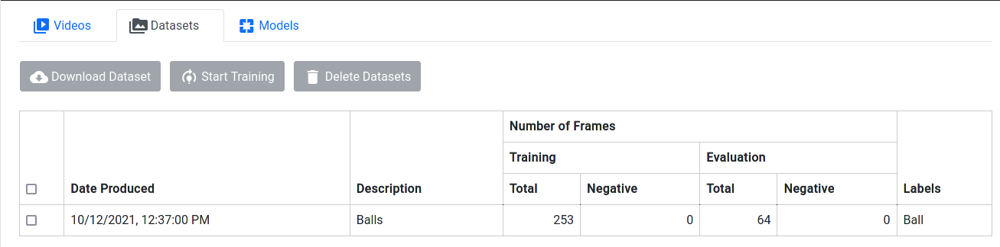

Internal Details

> When the page loads:
> * the client:
>   * sends a /retrieveDatasetEntities request to the server
>   * the server, receiving the /retrieveDatasetEntities request:
>     * reads the Dataset entities from Cloud Datastore/Firestore
>     * responds with the Dataset entities
>   * inserts a row into the table for each dataset
>

### Downloading a Dataset

If one dataset is selected, the Download Dataset button is enabled.

When the user clicks Download Dataset, the Download Dataset dialog is shown.

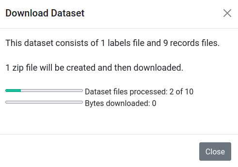

The system writes the labels file and the TensorFlow records into one or more
zip files. The dialog shows the progress of each zip file being produced. 
When the zip files are ready, the dialog shows the progress of each download.

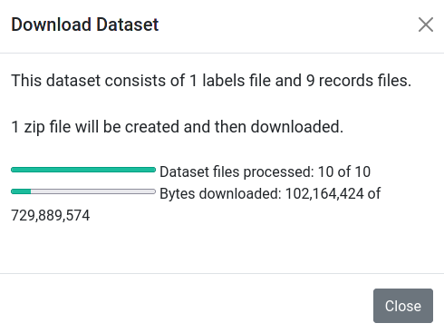

Internal Details

> When the user clicks Download Dataset:
> * the client:
>   * sends a /prepareToZipDataset request to the server
>   * the server, receiving the /prepareToZipDataset request:
>     * creates a unique id for the dataset zip
>     * decides how many partitions (separate zip files) are needed
>     * inserts DatasetZipper entities, one for each partition, into Cloud
>       Datastore/Firestore, setting the team_uuid, dataset_zip_uuid,
>       partition_index, and update_time fields
>     * triggers the start of a Cloud Function that will prepare the zip files
>     * responds with the dataset zip id and the partition count
>
> * the Cloud Function:
>   * reads the Dataset entity and DatasetRecord entities from Cloud Datastore/Firestore
>   * determines which partition will contain the labels file
>   * determines which partition will contain each TensorFlow record file
>   * updates the DatasetZipper entities, setting the file_count and update_time fields
>   * triggers the start of many Cloud Functions that will write the zip files
>
> * each zip writer Cloud Function:
>   * creates a ZipFile object
>   * for each tensorflow record (or labels) file in the partition
>     * reads the file from Cloud Storage and writes it to the ZipFile object
>     * updates the DatasetZipper entity, setting the files_written and update_time fields
>   * writes the zip file to Cloud Storage
>
> * the client:
>   * updates the dialog to show the number of zip files
>   * periodically sends a /getDatasetZipStatus request to the the server to
>     determine the progress of dataset zipping
>   * the server, receiving the /getDatasetZipStatus request:
>     * reads the DatasetZipper entities from Cloud Datastore/Firestore
>     * collects the file_count and files_written fields for each entity
>     * generates signed urls for downloading the zip files from Cloud Storage,
>       if they have been written yet
>     * responds with the number of files written to each zip file so far and,
>       if ready, the signed urls for downloading the zip files from Cloud Storage.
>   * updates the "Dataset files processed" progress indicators in the Download Dataset dialog
>   * downloads the zip files from Cloud Storage using the signed urls
>   * updates the "Bytes downloaded" progress indicators in the Download
>     Dataset dialog

### Training a Model

If one or more datasets is selected, the Start Training button is enabled.

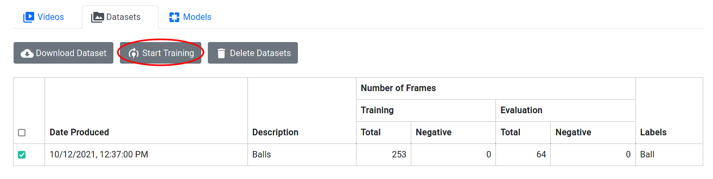

When the user clicks Start Training, the Start Training dialog is shown.

The dialog shows how many training minutes the team has remaining.
The user chooses the maximum training time, the starting model, and the number
of training steps, enters a description, and clicks Start Training. The system
submits the requests to start the training and the evaluation jobs. The training
job runs on a Cloud TPU and the evaluation job runs on a Cloud GPU.

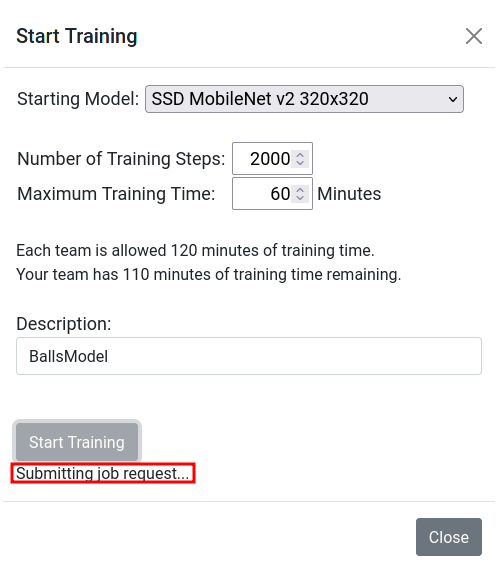

After the job requests have been submitted, the Start Training dialog goes away
and the [Models tab](#models-tab), is displayed. It can take several minutes
before the job starts running. 

...
<!--- TODO(lizlooney): add internal details --->

### Deleting a Dataset

If one or more datasets is selected, the Delete Datasets button is enabled.

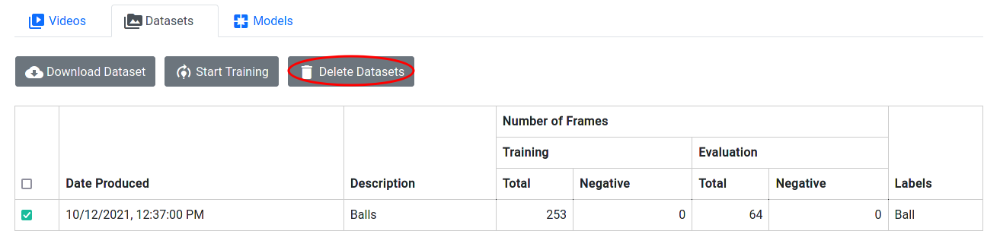

When the user clicks Delete Datasetss, the system determines whether the selected
datasets can be deleted. Datasets that have been used to produce a model cannot
be deleted until after the model is deleted.

If the selected datasets cannot be deleted, a dialog explaining why is shown:

Internal Details

> When the user clicks Delete Datasets
> * the client:
>   * sends a /canDeleteDatasets request to the server
>   * the server, receiving the /canDeleteDatasets request:
>     * reads the Dataset entities from Cloud Datastore/Firestore
>     * reads the Model entities from Cloud Datastore/Firestore
>     * checks whether any models are using any of the datasets that might be
>       deleted.
>     * responds with a boolean value indicating whether the datasets can be
>       deleted, and, if necessary, helpful messages explaining why a dataset
>       cannot be deleted.

If the selected datasets can be deleted, a confirmation dialog is shown:

If the users clicks Yes, the selected datasets will be deleted.

Internal Details

> When the user clicks Yes in the confirmation dialog:
> * the client:
>   * for each dataset being deleted:
>     * sends a /deleteDataset request to the server
>     * the server, receiving the /deleteDataset request:
>       * updates the Dataset entity, setting the delete_in_progress field
>       * triggers the start of a Cloud Function that will delete the dataset
>       * responds with 'OK'
>
> * the Cloud Function:
>   * deletes the Dataset entity from Cloud Datastore/Firestore
>   * deletes the dataset's labels file from Cloud Storage
>   * repeats the following until deleting is finished:
>     * deletes up to 500 TensorFlow record files from Cloud Storage
>     * deletes up to 500 DatasetRecord entities from Cloud Datastore/Firestore
>     * checks how long it has been running:
>       * if it is within 70 seconds of the estimated time limit, triggers the
>         start of another Cloud Function to continue deleting
>       * if it is within 30 seconds of the estimated time limit, terminates

## Models Tab

If no models have been created, the Models tab looks like this:

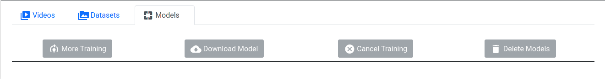

When a training job is running, the Models tab looks like this.

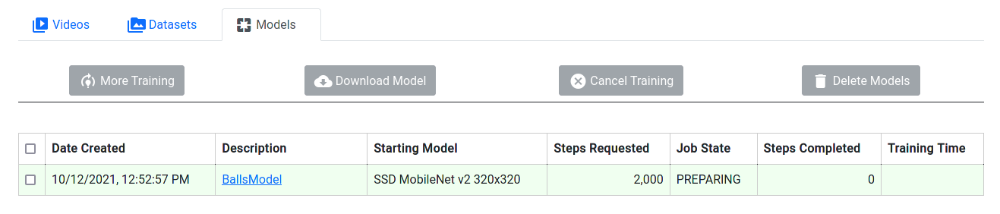

When a training job is finished, the Models tab looks like this.

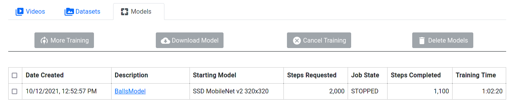

If the training job takes more than the maximum training time, it will be
canceled automatically. Even though the job was canceled, the last checkpoint
is available for downloading a TensorFlow Lite model.

The description is a clickable link. To monitor model training, the user clicks
on the description for that model.

Internal Details

> When the page loads:
> * the client:
>   * sends a /retrieveModelEntities request to the server
>   * the server, receiving the /retrieveModelEntities request:
>     * reads the Team entity from Cloud Datastore/Firestore
>     * reads the Model entities from Cloud Datastore/Firestore
>     * responds with the total training minutes each team is given, the
>       remaining training minutes this team still has, and the Model
>       entities
>   * inserts a row into the table for each model
>
> * if training has not finished on a model, the client periodically:
>   * sends a /retrieveModelEntity request to the server
>   * the server, receiving the /retrieveModelEntity request:
>     * reads the Team entity from Cloud Datastore/Firestore
>     * reads the Model entity from Cloud Datastore/Firestore
>     * responds with the remaining training minutes this team still has, and
>       the Model entity
>   * updates the row in the table for that model

### Monitoring Model Training

#### Details Tab

The Details tab shows information about the model being trained.

If the training job takes more than the maximum training time, it will be
canceled automatically.

#### Graphs Tab

The Graphs tab shows training and evaluation metrics.

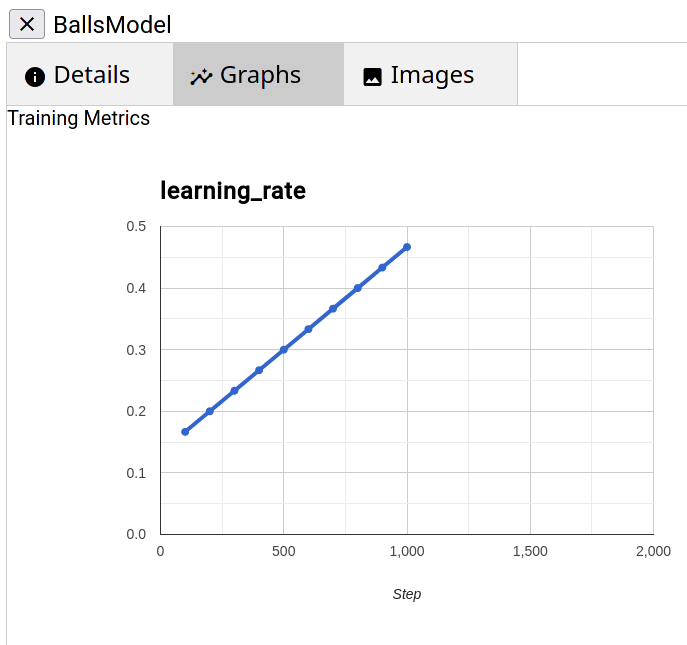

Graphs with names that end in IOU show the
[Intersection over Union](https://www.pyimagesearch.com/2016/11/07/intersection-over-union-iou-for-object-detection/)
 metric, which indicates the accuracy of object detection.

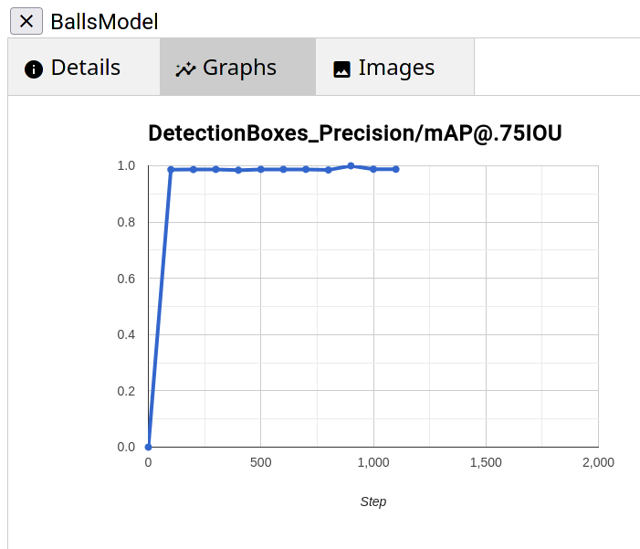

#### Images Tab

The Images tab shows side by side images where the left image shows the bounding
boxes that were produced by the model and the right image shows the bounding
boxes that were labeled by the user.

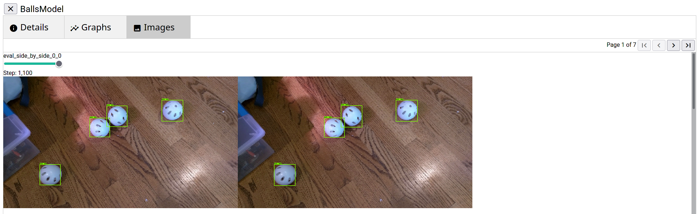

Above each image is a slider that allows the user to choose the checkpoint of
the model. Here we see that after 100 steps of training, the model was able to
detect 3 of the 4 wiffle balls.

If you want to see the full size image, you can use your browser's Open Image
in New Tab feature.

### More Training

If one model is selected and that model's training has finished and saved a
checkpoint, the More Training button is enabled.

When the user clicks More Training, the More Training dialog is shown.

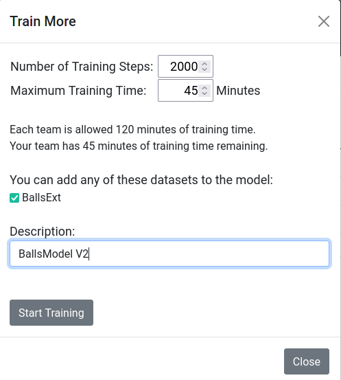

The user can choose to continue training with just the original dataset or with
additional datasets.

...
<!--- TODO(lizlooney): add internal details --->

### Downloading a Model

If one model is selected and that model's training has finished and saved a
checkpoint, the Download Model button is enabled.

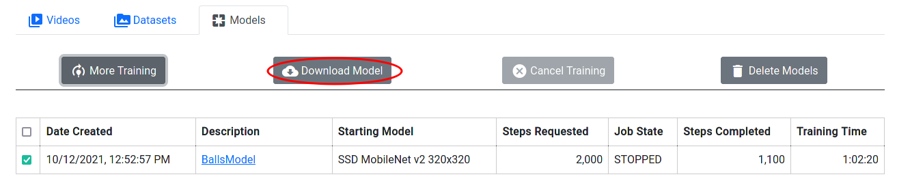

...
<!--- TODO(lizlooney): add content here --->
<!--- TODO(lizlooney): add internal details --->

### Canceling Training

If one model is selected and that model's training is not finished and has not
already been cancelled, the Cancel Training button is enabled.

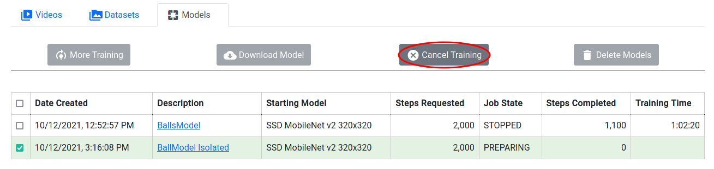

...
<!--- TODO(lizlooney): add content here --->
<!--- TODO(lizlooney): add internal details --->

### Deleting a Model

If one or more models is selected and those models' training is finished, the
Delete Models button is enabled.

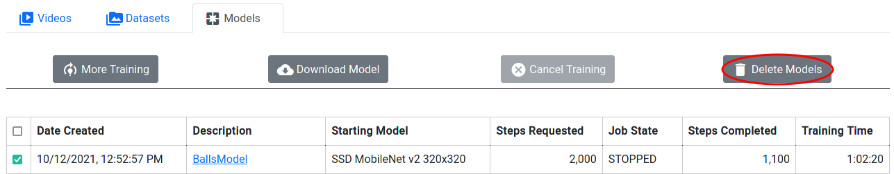

When the user clicks Delete Models, the system determines whether the selected
models can be deleted. Models that have been used as a starting point for more
training cannot be deleted until after the other model is deleted.

If the selected models cannot be deleted, a dialog explaining why is shown:

Internal Details

> When the user clicks Delete Models
> * the client:
>   * sends a /canDeleteModels request to the server
>   * the server, receiving the /canDeleteModels request:
>     * reads the Model entities from Cloud Datastore/Firestore
>     * checks whether any models are using any of the models that might be
>       deleted.
>     * responds with a boolean value indicating whether the models can be
>       deleted, and, if necessary, helpful messages explaining why a model
>       cannot be deleted.

If the selected models can be deleted, a confirmation dialog is shown:

If the users clicks Yes, the selected models will be deleted.

Internal Details

> When the user clicks Yes in the confirmation dialog:
> * the client:
>   * for each model being deleted:
>     * sends a /deleteModel request to the server
>     * the server, receiving the /deleteModel request:
>       * updates the Model entity, setting the delete_in_progress field
>       * triggers the start of a Cloud Function that will delete the model
>       * responds with 'OK'
>
> * the Cloud Function:
>   * deletes the model files from Cloud Storage
>     * checks how long it has been running:
>       * if it is within 70 seconds of the estimated time limit, triggers the
>         start of another Cloud Function to continue deleting
>       * if it is within 30 seconds of the estimated time limit, terminates
>   * deletes the Model entity from Cloud Datastore/Firestore

