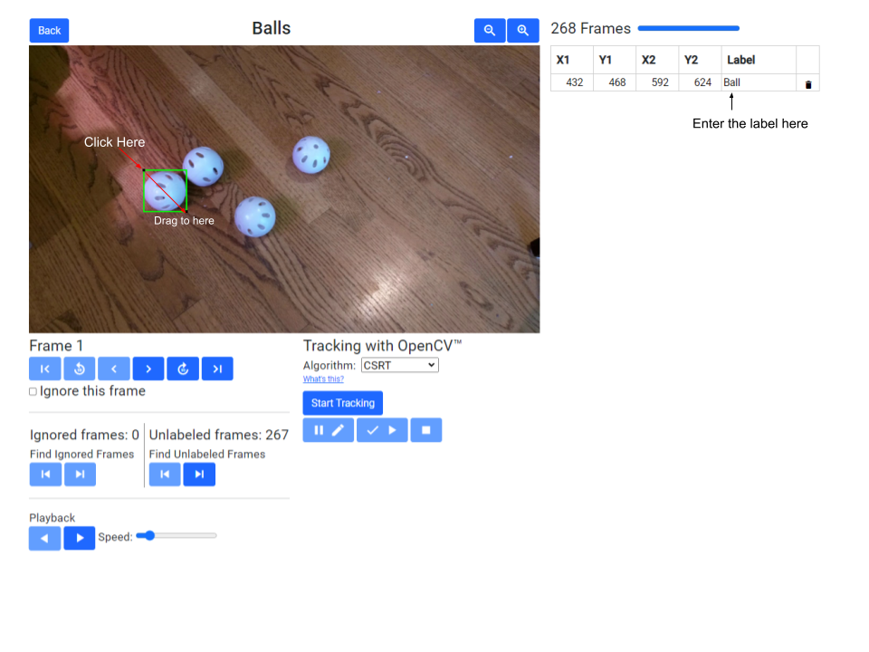
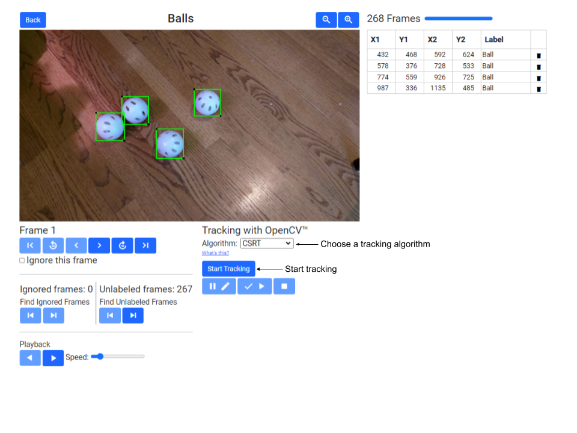

# **Design Overview**

FMLTC stands for FIRST Machine Learning Toolchain.

The goal of the project is to deliver the source code for a web-based set of
tools that allow a FIRST Tech Challenge (FTC) or FIRST Robotics Competition
(FRC) team to  generate a custom TensorFlow inference model for object
detection and tracking. 

The target platform for the project is Google Cloud:
 * App Engine for hosting the web application
 * Cloud Functions for operations that take longer than 30 seconds
 * Cloud Datastore/Firestore for storing entities
   + Application entities
     + Team entities
     + Tracker entities
     + DatasetRecordWriter entities
     + DatasetZipper entities
   + User entities
     + Video entities
     + VideoFrame entities
     + Dataset entities
     + DatasetRecord entities
 * Cloud Storage for storing files
   + Application files
     + javascript files
     + css files
     + files to trigger Cloud Functions
     + Object Detection package files
     + SSD MobileNet checkpoint files
   + User files
     + Video files
     + Image files
     + TensorFlow Record files
     + files for the TensorFlow Model

The steps involved in generating the model are:
1. Upload videos
2. Label objects in video frame images with assistance from object tracking
3. Produce TensorFlow records from the labeled images
4. Train a TensorFlow model
5. Convert the model to TFLite format

# Login screen

When a user visits the website for the first time, they are presented with a
login screen.

The user selects their FIRST program, enters their team number and team code,
and clicks Submit.

Internal Details

> The client sends a /login request with the FIRST program, team number, and 
> team code to the server.
> 
> The server reads the teams file from Cloud Storage and looks for a line with
> matching FIRST program, team number, and team code. If found, the values are
> stored in the session so the user doesn't have to login again on the same
> machine.

# Main screen

After the user logs in, the main screen appears. There are three tabs
 * Videos - show the videos that this team has uploaded
 * Datasets - show the datasets that this team has produced
 * Models - show the TensorFlow models that this team has generated

## Videos tab

At first, since the team has not yet uploaded any videos, the Videos tab looks like this:

### Uploading a Video

When the user clicks Upload Video, they are presented with the Upload Video File dialog:

The user chooses a file, enters a description, and clicks Upload.

Internal Details

> The client sends a /prepareToUploadVideo request to the server.
> 
> The server:
>  * creates a unique id for the video
>  * generates a signed url for uploading the video file to Cloud Storage
>  * inserts a video entity into the database
>  * triggers the start of a Cloud Function which will extract the frames of the video
> The server's response includes the video id and the upload url.
> 
> The client sends the video file to the upload url. As the file is uploaded, a
> progress bar is updated.

When the upload has finished, the dialog is dismissed.

Internal Details

> In the server, the Cloud Function:
>  * waits until the video file has finished uploading to Cloud Storage
>  * reads the video file from Cloud Storage and writes it to a temporary file
>  * opens the temporary file with OpenCV.
>  * updates the video entity in Cloud Datastore/Firestore with the width, height, frames per second, and frame count.
>  * extracts frames of the video and writes them as jpeg image files to Cloud Storage
>  * periodically checks how long it has been running:
>    + if it has be running for over 430 seconds, it triggers the start of  
>      another Cloud Function to continue extracting frames.
>    + if it has be running for over 470 seconds, it terminates.
>  * deletes the temporary file
> 
> Until frame extraction is complete, the client sends a /retrieveVideoEntity
> request to the the server once per second and updates the display.

When frame extraction is complete, the description becomes a clickable link. To
label the objects in a video, the user clicks on the description for that video.

### Labeling a Video

The Video Frame Labeling page allows the user to view the frames of the video 
and the labeled objects.

As shown in the image above, the user can:
 * adjust the size of the preview
 * navigate through the frames of the video
 * find frames that have not been labeled
 * play the video forward or reverse
 * exclude a frame from datasets made from the video in the future

Internal Details

> When the Video Frame Labeling page is loaded, the client sends one or more
> /retrieveVideoFrameEntitiesWithImageUrls requests to the server. Each request
> asks for up to 100 video frame entities.
> 
> The server responds with the video frame entities, with each entity 
> containing a signed url for requesting the image from Cloud Storage.
> 
> The client requests the images from Cloud Storage using the signed urls.

The progress bar on the upper right area of the page indicates how many entities
and images have been received. If the user navigates to a frame whose image has
not been received yet, the preview frame will be blank.

The following buttons remain disabled until all frame entities have been 
received:
  * the buttons that find frames that have not been labeled
  * the button that starts tracking

#### Drawing a Box and Entering a Label

To label an object on the frame, the user clicks the mouse in the preview, at
the upper-left corner of the object, holds the mouse button down and drags to
the lower-right corner, and then releases the mouse button. A new row is added
to the table on the right side and the user enters a label for the object.

The user should use consistent labels for the objects. For example, in the video
shown here, all wiffle balls will be labeled "w".

Internal Details

> Each time a box or label is created or modified, the client sends a
> /storeVideoFrameBboxesText request to the server.
> 
> The server stores the boxes and labels in the video frame entity and updates 
> the labeled frame count in the video entity.

#### Tracking

Once all objects on the first frame are labeled, the user can use the tracking
feature to label the rest of the frames. There are several algorithms available
for tracking. The default algorithm is CSRT (discriminative correlation filter
tracker with channel and spatial reliability) and it provides high accuracy and
is relatively quick.

To start tracking, the user clicks the start tracking button.

### Creating a Dataset

### Deleting a Video

## Datasets tab

### Training a Model

### Deleting a Dataset

## Models tab

### Monitoring Model Training

### More Training

### Deleting a Model
