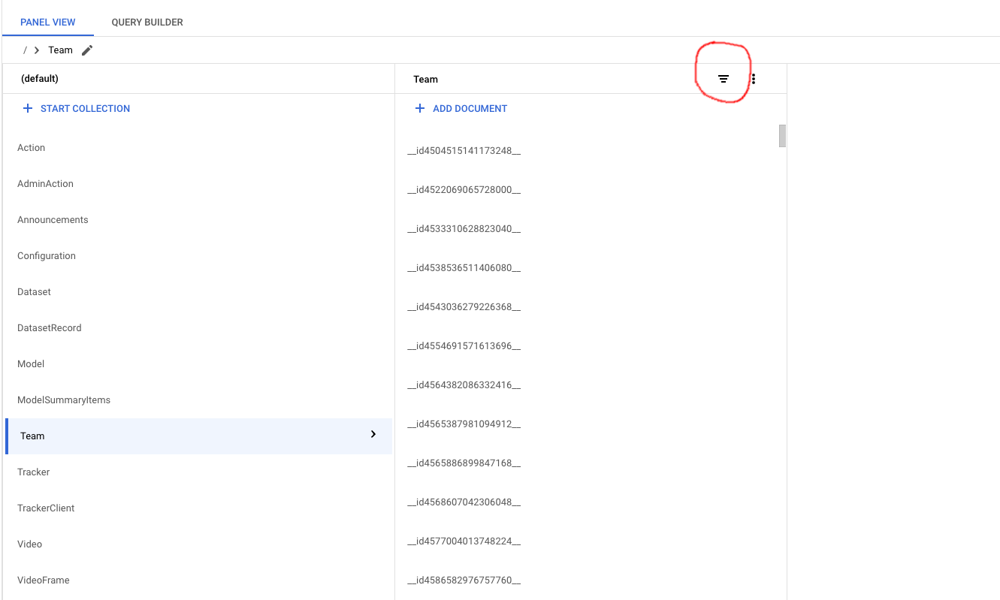
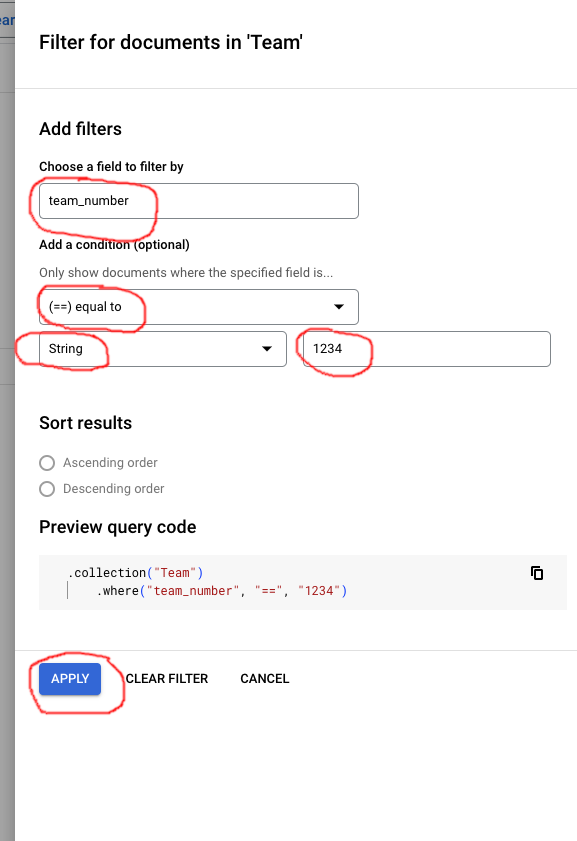
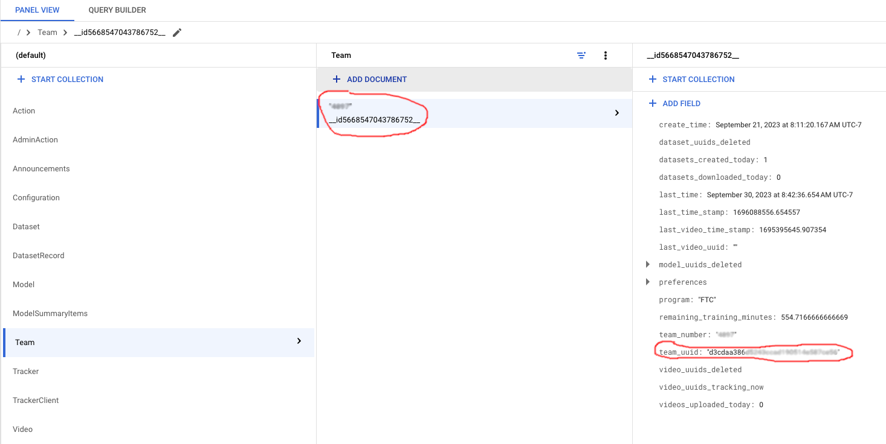
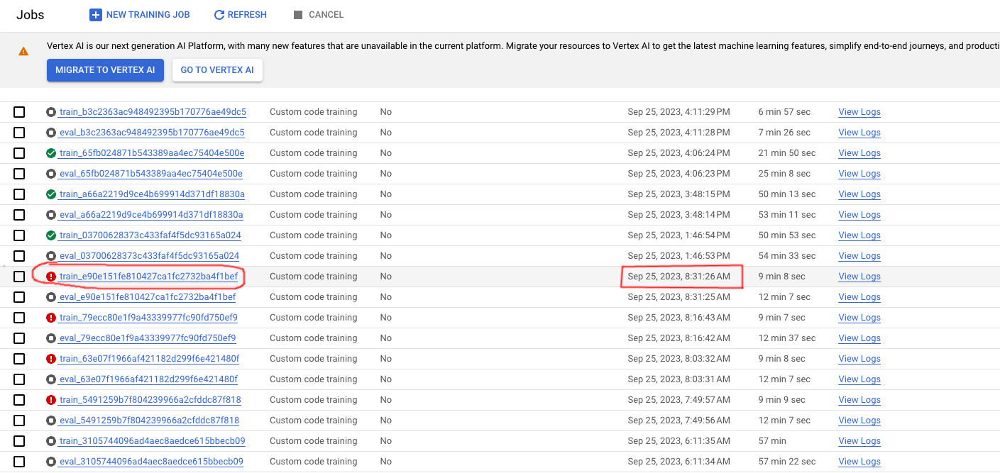
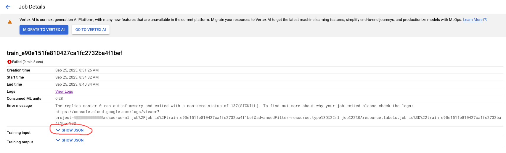
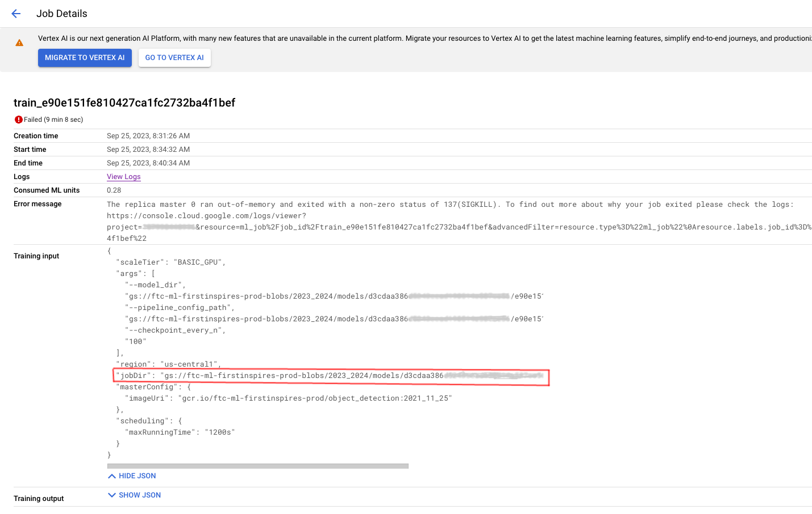
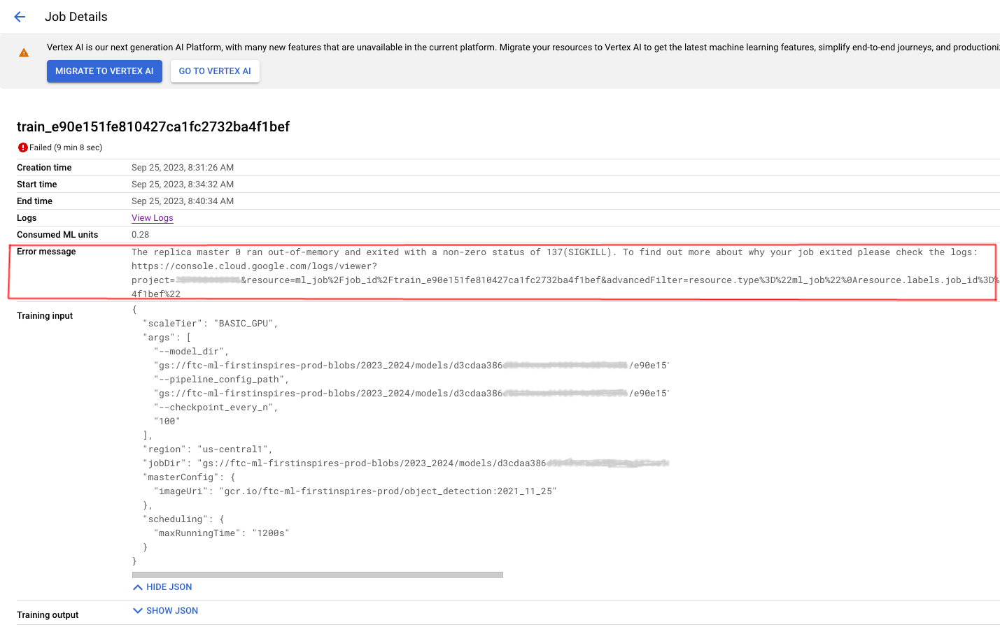
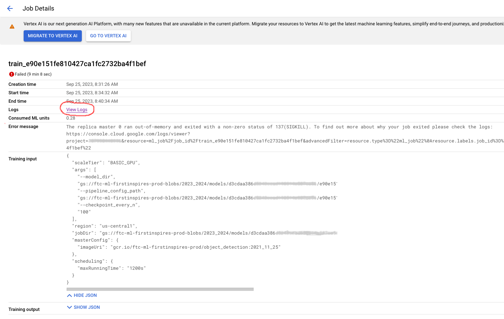

# How to Investigate a Training Failure

## Information You Will Need

- The **team number**. 
  In the rest of this document, I'll refer to this as `<team_number>`.
- The approximate **date and time**, in your time zone, when the failure occured.
- The Google Cloud **project name**. 
  In the rest of this document, I'll refer to this as `<gcp_project>`.

## Let's Investigate!

### Find the team's UUID.

  1. In a browser, go to <a href="https://console.cloud.google.com/firestore/databases/-default-/data/panel/Team?project=">https://console.cloud.google.com/firestore/databases/-default-/data/panel/Team?project=</a>`<gcp_project>`
  1. Click on the filter documents button&nbsp;&nbsp; 
     
  1. Fill in the filtering criteria, using `<team_number>` instead of `1234`, and then click  
     
  1. If the right column is blank, click on the document id in the **Team** column. 
  1. Look in the right column for the **team_uuid** field.
     
  1. Write down the **team_uuid** value. 
     In the rest of this document, I'll refer to this as `<team_uuid>`.

### Find the training job.

  1. In another browser tab, go to <a href="https://console.cloud.google.com/ai-platform/jobs?project=">https://console.cloud.google.com/ai-platform/jobs?project=</a>`<gcp_project>` 
  1. Find the failing job at the date and time when the failure occured.
     
     - Scroll down and/or go to the next page if necessary
  1. Right-Click on the training job id and choose **Open Link in New Tab**. 
  1. On the Job Details page, look for **Training input** and click  
     
  1. Look for the **jobDir** field. 
     The format of the **jobDir** value is `gs://ftc-ml-firstinspires-prod-blobs/2023_2024/models/<team_uuid>/<model_uuid>`
     
  1. Verify that the **jobDir** value contains the `<team_uuid>` value that you wrote down. 
  1. If **team_uuid** part of the **jobDir** value does not match `<team_uuid>` that you wrote down, this job belongs to a different team. 
     Go back to the jobs list and find another job that failed at around the same date and time. Repeat steps 3-6.

### Examine the error message and logs.

  1. Once you have verified that the job belongs to the correct team, you can look at the **Error message** displayed on the job details page. 
     
  1. If more information is needed, click on **View Logs** to see the logs for the job. 
     
