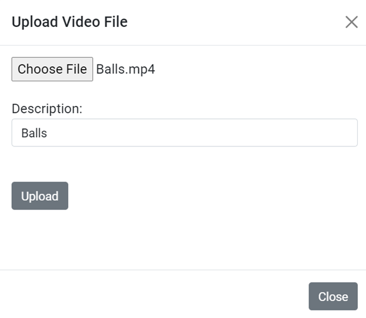
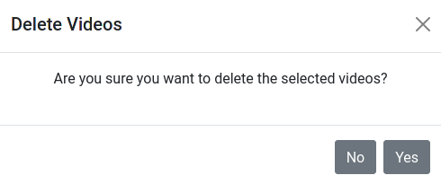
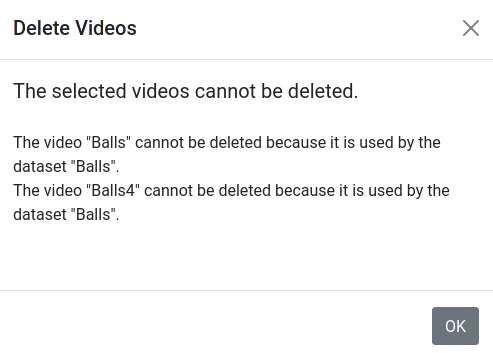
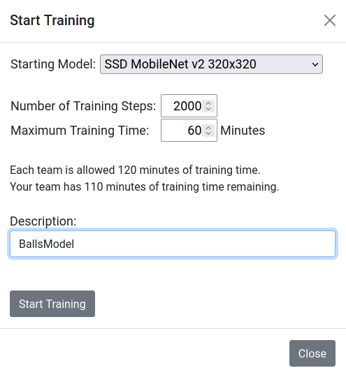
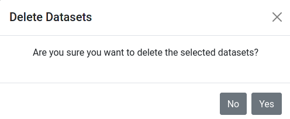
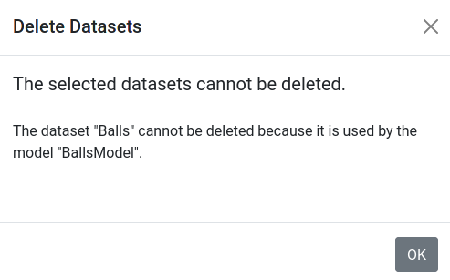
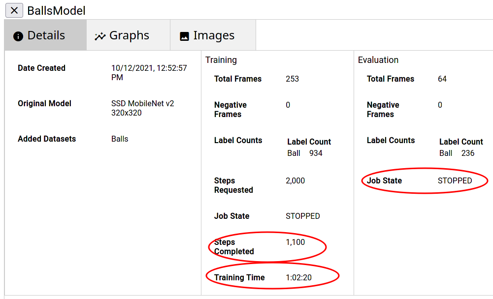
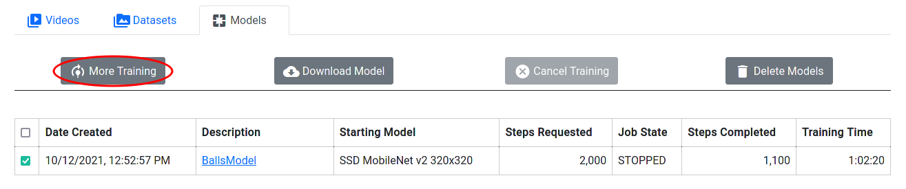
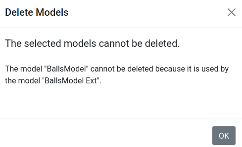
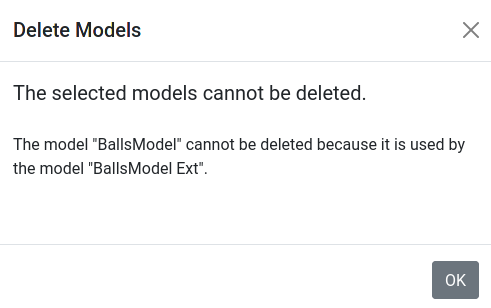

# **FIRST Machine Learning Toolchain**

##### Table of Contents
1. [Overview](#overview)
1. [Login Page](#login-page)
1. [Main Page](#main-page)
   1. [Videos Tab](#videos-tab)
      1. [Uploading a Video](#uploading-a-video)
      1. [Labeling a Video](#labeling-a-video)
         1. [Drawing a Box and Entering a Label](#drawing-a-box-and-entering-a-label)
         1. [Tracking](#tracking)
      1. [Producing a Dataset](#producing-a-dataset)
      1. [Deleting a Video](#deleting-a-video)
   1. [Datasets Tab](#datasets-tab)
      1. [Downloading a Dataset](#downloading-a-dataset)
      1. [Training a Model](#training-a-model)
      1. [Deleting a Dataset](#deleting-a-dataset)
   1. [Models Tab](#models-tab)
      1. [Monitoring Model Training](#monitoring-model-training)
         1. [Details Tab](#details-tab)
         1. [Graphs Tab](#graphs-tab)
         1. [Images Tab](#Images-tab)
      1. [More Training](#more-training)
      1. [Downloading a Model](#downloading-a-model)
      1. [Canceling Training](#canceling-training)
      1. [Deleting a Model](#deleting-a-model)

# Overview

The goal of the project is to deliver the source code for a web-based set of
tools that allow a FIRST Tech Challenge (FTC) or FIRST Robotics Competition
(FRC) team to  generate a custom TensorFlow inference model for object
detection and tracking.

The steps involved in generating a TensorFlow Lite inference model for object detection are:
1. Upload videos
2. Label objects in video frame images with assistance from object tracking
3. Produce TensorFlow records from the labeled images
4. Train a TensorFlow model
5. Convert the model to TFLite format

The target platform for the project is Google Cloud:
 * App Engine for hosting the web application
 * Cloud Functions for operations that take longer than 30 seconds
 * Cloud Datastore/Firestore for storing entities
   + Application entities
     + Team entities
     + Tracker entities
     + TrackerClient entities
     + DatasetRecordWriter entities
     + DatasetZipper entities
   + User entities
     + Video entities
     + VideoFrame entities
     + Dataset entities
     + DatasetRecord entities
 * Cloud Storage for storing files
   + Application files
     + javascript files
     + css files
     + files to trigger Cloud Functions
     + Object Detection package files
     + SSD MobileNet checkpoint files
   + User files
     + Video files
     + Image files
     + TensorFlow Record files
     + files for the TensorFlow Model
 * Cloud TPU (Tensor Processing Unit) for running model training jobs
 * Cloud GPU (Graphics Processing Unit) for running model evaluation jobs

# Login Page

When a user visits the website for the first time, the login page is shown.

The user selects their FIRST program, enters their team number and team code,
and clicks Submit.

# Main Page

After the user logs in, the main page appears. There are three tabs
 * Videos - show the videos that this team has uploaded
 * Datasets - show the datasets that this team has produced
 * Models - show the TensorFlow models that this team has generated

## Videos Tab

At first, since the team has not yet uploaded any videos, the Videos tab looks like this:

After videos have been uploaded and labeled, the Videos tab looks like this:

### Uploading a Video

When the user clicks Upload Video, the Upload Video File dialog is shown:

The user chooses a file, enters a description, and clicks Upload.

As the file is uploaded, a progress bar is updated.

When the upload has finished, the dialog goes away.

After a video is uploaded, frame extraction will start automatically. 

When frame extraction finishes, the description becomes a clickable link. To
label the objects in a video, the user clicks on the description for that video.

### Labeling a Video

The Video Frame Labeling page allows the user to view the frames of the video
and the labeled objects.

As shown in the image above, the user can:
 * adjust the size of the frame viewer
 * navigate through the frames of the video
 * find frames that have not been labeled
 * play the video forward or reverse
 * exclude a frame from datasets made from the video in the future

The progress bar on the upper right area of the page indicates how many entities
and images have been received. If the user navigates to a frame whose image has
not been received yet, the frame viewer will be blank.

The following buttons remain disabled until all VideoFrame entities have been
received:
  * the buttons that find frames that have not been labeled
  * the button that starts tracking

#### Drawing a Box and Entering a Label

To label an object on the frame, the user clicks the mouse in the frame viewer,
at the upper-left corner of the object, holds the mouse button down and drags to
the lower-right corner, and then releases the mouse button. A new row is added
to the table on the right side and the user enters a label for the object.

The user should use consistent labels for the objects. For example, in the video
shown here, all wiffle balls will be labeled "Ball".

#### Tracking

Once all objects on the first frame are labeled, the user can use the tracking
feature to label the rest of the frames. There are several algorithms available
for tracking. The default algorithm is CSRT (discriminative correlation filter
tracker with channel and spatial reliability) and it provides high accuracy and
is relatively quick.

To start tracking, the user clicks the start tracking button.

The tracker can take up to 30 seconds to begin processing the video frames.
Once it starts, the frame viewer will navigate through the frames and show
the tracked boxes. If the boxes aren't accurately placed, the user can click
the Pause Tracking button to pause the tracker and then they can adjust the
boxes.

The user can click the Continue Tracking button to continue tracking
or click the Stop Tracking button to stop tracking.

### Producing a Dataset

After the video(s) have been labeled, the user can produce a dataset.

If one or more videos is selected, the Produce Dataset button is enabled.

When the user clicks Produce Dataset, the Produce Dataset dialog is shown:

The users chooses the percentage of frames that will be used for training and
the percentage of frames that will be used for evaluation, enters a description,
and clicks Produce Dataset.

As the dataset is produced, a progress bar is updated.

When the dataset has been produced, the dialog goes away.

### Deleting a Video

If one or more videos is selected, the Delete Videos button is enabled.

When the user clicks Delete Videos, the system determines whether the selected
videos can be deleted. Videos that have been used to produce a dataset cannot
be deleted until after the dataset is deleted.

A confirmation dialog is shown after the delete button has been pressed:

If the users clicks Yes, the selected videos and their frame images labels will be deleted.

If the selected videos cannot be deleted, a dialog explaining why is shown:

## Datasets Tab

If no datasets have been produced, the Datasets tab looks like this:

After a dataset has been produced, the Datasets tab looks like this:

### Downloading a Dataset

If one dataset is selected, the Download Dataset button is enabled.

When the user clicks Download Dataset, the Download Dataset dialog is shown.

The system writes the labels file and the TensorFlow records into one or more
zip files. The dialog shows the progress of each zip file being produced. 
When the zip files are ready, the dialog shows the progress of each download.

### Training a Model

If one or more datasets is selected, the Start Training button is enabled.

When the user clicks Start Training, the Start Training dialog is shown.

The dialog shows how many training minutes the team has remaining.
The user chooses the maximum training time, the starting model, and the number
of training steps, enters a description, and clicks Start Training. The system
submits the requests to start the training and the evaluation jobs. The training
job runs on a Cloud TPU and the evaluation job runs on a Cloud GPU.

After the job requests have been submitted, the Start Training dialog goes away
and the [Models tab](#models-tab), is displayed. It can take several minutes
before the job starts running. 

<!--- TODO(lizlooney): add internal details --->

### Deleting a Dataset

If one or more datasets is selected, the Delete Datasets button is enabled.

When the user clicks Delete Datasetss, the system determines whether the selected
datasets can be deleted. Datasets that have been used to produce a model cannot
be deleted until after the model is deleted.

A confirmation dialog is shown after the delete button has been pressed:

If the users clicks Yes, the selected datasets will be deleted.

If the selected datasets cannot be deleted, a dialog explaining why is shown:

## Models Tab

If no models have been created, the Models tab looks like this:

When a training job is running, the Models tab looks like this.

When a training job is finished, the Models tab looks like this.

If the training job takes more than the maximum training time, it will be
canceled automatically. Even though the job was canceled, the last checkpoint
is available for downloading a TensorFlow Lite model.

The description is a clickable link. To monitor model training, the user clicks
on the description for that model.

### Job States

| Name | Description |
|--- | --- |
| SUCCEEDED | The model has been trained successfully |
| FAILED | The model training has failed | 
| CANCELLED | The user cancelled the job prior to any checkpoints being created. For that model, More Training and Download Model will not be possible. | 
| STATE_UNSPECIFIED | This means that the model is in an unpredicted state. Please file an issue on github |
| QUEUED | The job has been queued but has not yet started. If your job has the status QUEUED for more than a few minutes, it is probably waiting for a TPU (Tensor Processing Unit) to become available |
| PREPARING | The job is preparing to run. |
| RUNNING | The job is running. |
| STOP REQUESTED | The user pressed the stop button and the server sent the request to stop the job, but it hasn't changed to CANCELLING yet in the job. |
| STOPPING | The job is in the process of being stopped |
| STOPPED | The user cancelled the job after checkpoints were created. For that model, More Training and Download Model will be possible.  |

### Monitoring Model Training

#### Details Tab

The Details tab shows information about the model being trained.

If the training job takes more than the maximum training time, it will be
canceled automatically.

#### Graphs Tab

The Graphs tab shows training and evaluation metrics.

Graphs with names that end in IOU show the
[Intersection over Union](https://www.pyimagesearch.com/2016/11/07/intersection-over-union-iou-for-object-detection/)
 metric, which indicates the accuracy of object detection.

#### Images Tab

The Images tab shows side by side images where the left image shows the bounding
boxes that were produced by the model and the right image shows the bounding
boxes that were labeled by the user.

Above each image is a slider that allows the user to choose the checkpoint of
the model. Here we see that after 100 steps of training, the model was able to
detect 3 of the 4 wiffle balls.

If you want to see the full size image, you can use your browser's Open Image
in New Tab feature.

### More Training

If one model is selected and that model's training has finished and saved a
checkpoint, the More Training button is enabled.

When the user clicks More Training, the More Training dialog is shown.

The user can choose to continue training with just the original dataset or with
additional datasets.

<!--- TODO(lizlooney): add internal details --->

### Downloading a Model

If one model is selected and that model's training has finished and saved a
checkpoint, the Download Model button is enabled.

<!--- TODO(lizlooney): add content here --->
<!--- TODO(lizlooney): add internal details --->

### Canceling Training

If one model is selected and that model's training is not finished and has not
already been cancelled, the Cancel Training button is enabled.

<!--- TODO(lizlooney): add content here --->
<!--- TODO(lizlooney): add internal details --->

### Deleting a Model

If one or more models is selected and those models' training is finished, the
Delete Models button is enabled.

When the user clicks Delete Models, the system determines whether the selected
models can be deleted. Models that have been used as a starting point for more
training cannot be deleted until after the other model is deleted.

A confirmation dialog is shown after the delete button has been pressed:

If the users clicks Yes, the selected models will be deleted.

If the selected models cannot be deleted, a dialog explaining why is shown:

